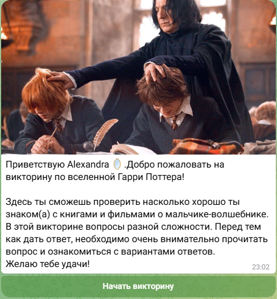
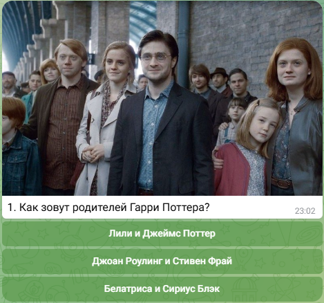
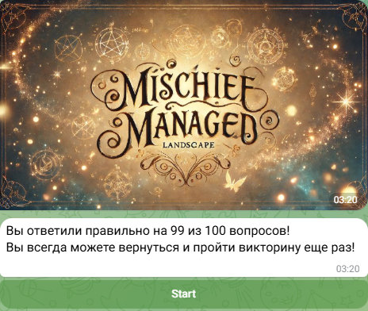

# 🧙‍♂️ Telegram-бот: Квиз по Гарри Поттеру

Добро пожаловать в репозиторий Telegram-бота **@HarryPotterMyQuizBot**! Это интерактивная викторина по вселенной Гарри Поттера, состоящая из 100 вопросов разной сложности.

---

## 🔮 Что умеет этот бот?

* **100 вопросов:** Каждый вопрос включает три варианта ответов.
* **Интерактивный интерфейс:** Никаких команд вводить не нужно, только кнопки!
* **Обратная связь:** Бот моментально реагирует, сообщая, правильный ли был ответ.
* **Итоги викторины:** После прохождения викторины пользователь увидит количество правильных ответов.

---

## 📸 Примеры работы







---

## 🛠️ Технологии

* **Python**
* **python-telegram-bot**

---

## 🚀 Запуск и настройка

### Шаг 1: Клонируй репозиторий

```bash
git clone https://github.com/yourusername/HarryPotterQuizBot.git
cd HarryPotterQuizBot
```

### Шаг 2: Установи зависимости

```bash
pip install -r requirements.txt
```

### Шаг 3: Получи токен для бота

* В Telegram найди [@BotFather](https://t.me/BotFather).
* Создай нового бота и получи токен.

### Шаг 4: Запусти бота

Создай файл `.env` и вставь свой токен:

```env
TOKEN=твой-токен-здесь
```

Запусти бота:

```bash
python bot.py
```

### 🖥️ Деплой

Бот может запускаться на локальном компьютере, но для бесперебойной работы рекомендуется развернуть его на сервере (например, VPS).

---

## 📫 Связь со мной

* **Telegram:** [@Alex\_Gicheva](https://t.me/Alex_Gicheva)
* **Email:** [alexgicheva@gmail.com](mailto:alexgicheva@gmail.com)

---

✨ **Приятного пользования и магического настроения!** ✨
